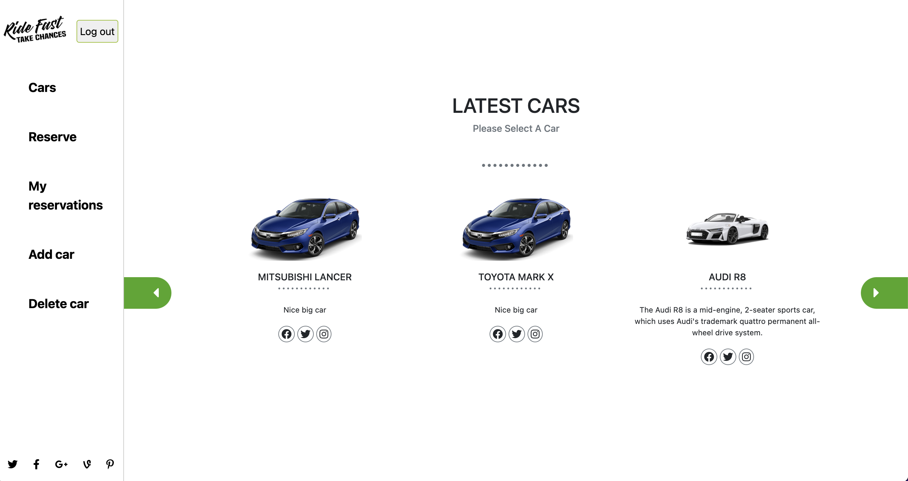

# Ride Fast - Final capstone project

- This project is the Final Capstone Project in Microverse and is based on an app to reserve a car.



[Live Link](https://ride-fast-app.netlify.app/)

## Project Decription

- Ride fast is built in two different apps with React and Redux for the front end and Ruby on Rails for the backend API. To use the app, a user logs in and is given access to the available cars. They have the options to add, delete and reserve a car.

## Back End

[Api Documentation](https://ridefast.herokuapp.com/api-docs/index.html)

[Back End project](https://github.com/PolinaStamenova/ride-fast-back-end)

## Built With

- `React`
- `Redux`

## Getting Started

To get a local copy up and running follow these simple example steps.

## Instructions

* Clone this repo with:

    ```bash
    git clone https://github.com/PolinaStamenova/ride-fast-front-end.git
    ```

* Navigate to the folder/directory

    ```bash
    cd ride-fast-front-end
    ```

### Install

```sh
npm install
```

### Usage

```sh
npm start
```

## Authors

👤 **Gift Uwhubetine**

- GitHub: [@githubhandle](https://github.com/Ghiftee)
- LinkedIn: [LinkedIn](https://linkedin.com/in/giftuwhubetine)

👤 **Aganze Mataba Henri**

- GitHub: [@githubhandle](https://github.com/hiromataba)
- LinkedIn: [LinkedIn](https://www.linkedin.com/in/hiro-mataba-1bb910209/)

👤 **Polina Stamenova**

- GitHub: [@githubhandle](https://github.com/PolinaStamenova)
- LinkedIn: [LinkedIn](https://www.linkedin.com/in/polina-stamenova-a60766112/)

👤 **Victor Otieno**

- GitHub: [@githubhandle](https://github.com/vikitaotiz)
- LinkedIn: [LinkedIn](https://www.linkedin.com/in/victor-otieno-oluoch/)

## 🤝 Contributing

Contributions, issues, and feature requests are welcome!

Feel free to check the [issues page](https://github.com/PolinaStamenova/ride-fast-front-end/issues).

## Show your support

Give a `⭐️` if you like this project!

## Acknowledgments

- Microverse
- Original design by Murat Korkmaz on Behance
